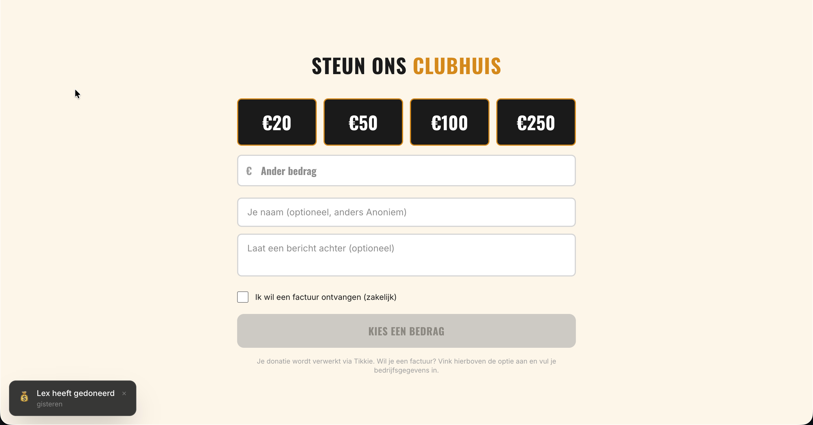
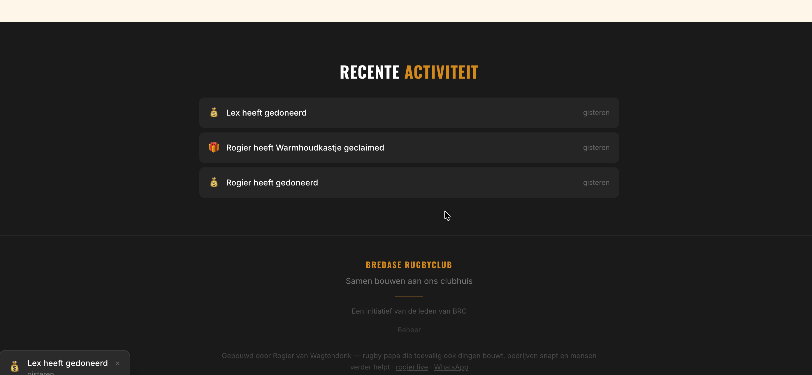
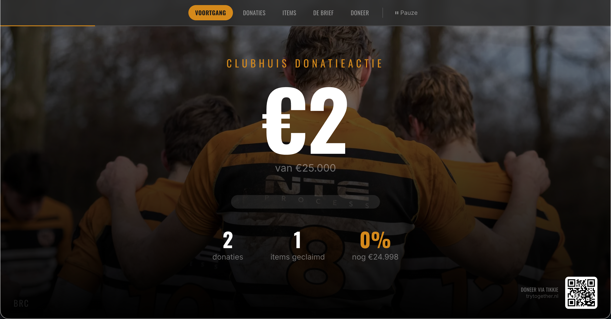

# tikkie-donation-platform

**Open-source donatie- en crowdfundingplatform met Tikkie betalingen. 0% platformkosten.**

Gebouwd met Next.js, Express en SQLite. Ideaal voor sportclubs, verenigingen, stichtingen, scholen, buurthuizen — iedereen die geld wil ophalen zonder dat er een percentage van de donaties naar een platform gaat.

> Bij veel crowdfundingplatforms verdampt er stilletjes 5-10% van elke donatie aan platformkosten. Dit platform koppelt direct aan Tikkie — 100% van elke euro gaat naar je doel.

## Features

- **Tikkie betalingen** — Donaties via Tikkie (ABN AMRO) met iDEAL. Iedereen kent het, iedereen vertrouwt het. Stub-modus voor ontwikkeling, productie-modus met echte betalingen.
- **0% commissie** — Geen platformkosten. Je draait het zelf, je houdt alles.
- **Realtime voortgang** — Live voortgangsbalk met doelbedrag en deadline countdown die motiveert.
- **Donatiemuur** — Recente donaties worden automatisch getoond.
- **Activity ticker** — Live notificaties van nieuwe donaties in de hoek van het scherm.
- **TV-modus** — Fullscreen display met automatisch roterende slides, QR-code en live stats. Perfect voor op een scherm in je clubhuis, school of kantoor.
- **Admin panel** — Beveiligd dashboard voor het beheren van donaties en campagne-instellingen.
- **Slack notificaties** — Realtime alerts bij donaties, dagelijkse samenvattingen en server health monitoring.
- **Zakelijke facturen** — Donateurs kunnen optioneel bedrijfsgegevens invullen voor een factuur.
- **Responsive design** — Werkt op desktop, tablet en mobiel.
- **WhatsApp delen** — Eenvoudig de actie delen via WhatsApp.
- **Docker ready** — Eenvoudige deployment met Docker en docker-compose.

## Mogelijke uitbreidingen

Dit platform is bewust simpel gehouden: een donatieactie met Tikkie. Maar je kunt het uitbreiden met:

- **Wishlist / items claimen** — Laat mensen specifieke spullen sponsoren (bijv. "Nieuwe stoelen €200"). Zie [trytogether.nl](https://trytogether.nl) voor een live voorbeeld.
- **Meerdere campagnes** — Verschillende doelen naast elkaar.
- **Email notificaties** — Bedankmails naar donateurs.
- **Betalingsbewijzen / PDF export**

## Screenshots

### Donatieformulier
Kies een bedrag, vul optioneel je naam en bericht in, en betaal via Tikkie.



### Live activiteit
Donaties en claims verschijnen realtime. De ticker linksonder toont de laatste activiteit.



### TV-modus
Fullscreen display met live voortgang, QR-code en automatisch roterende slides. Zet op een scherm in je clubhuis of kantoor.



## Quick start (lokale ontwikkeling)

```bash
# Clone de repository
git clone https://github.com/hfiv3/tikkie-donation-platform.git
cd tikkie-donation-platform

# Installeer dependencies
npm install

# Kopieer en configureer environment variabelen
cp .env.example .env

# Start development servers (frontend + backend)
npm run dev
```

De frontend draait op `http://localhost:3000`, de backend API op `http://localhost:3001`.

In development modus worden donaties automatisch als "paid" gemarkeerd (stub mode).

## Productie deployment (Docker)

```bash
# Bouw en start de container
docker compose up -d

# Of handmatig:
docker build -t tikkie-donation-platform .
docker run -d \
  -p 3000:3000 \
  -v tikkie-data:/app/data \
  --env-file .env \
  tikkie-donation-platform
```

**Belangrijk:** Mount `/app/data` als volume voor persistente SQLite data.

## Tikkie API instellen

> **Let op:** Dit platform gebruikt **Tikkie Zakelijk**, niet de particuliere Tikkie-app. Je hebt een zakelijk account nodig (als vereniging, stichting of bedrijf).

### Stap 1: Tikkie Zakelijk account

1. Ga naar [tikkie.me/zakelijk](https://www.tikkie.me/zakelijk) en meld je aan
2. Je hebt een **zakelijke ABN AMRO rekening** nodig (of KvK-inschrijving als vereniging/stichting)
3. Na goedkeuring heb je toegang tot het Tikkie Business portaal

### Stap 2: ABN AMRO Developer account + Production API key

1. Ga naar [developer.abnamro.com](https://developer.abnamro.com/) en maak een account aan
2. Registreer een nieuwe app en vraag toegang aan tot de **Tikkie API**
3. Test eerst met de **sandbox** API key (die krijg je direct)
4. Vraag een **production API key** aan — dit is een apart proces waarbij ABN AMRO je aanvraag beoordeelt. Duurt meestal een paar werkdagen.
5. Na goedkeuring ontvang je een **API Key** en **App Token**

### Stap 3: Configureren

```env
# Sandbox (testen)
TIKKIE_MODE=production
TIKKIE_API_KEY=jouw-sandbox-api-key
TIKKIE_APP_TOKEN=jouw-app-token
TIKKIE_SANDBOX=true

# Productie (echte betalingen)
TIKKIE_MODE=production
TIKKIE_API_KEY=jouw-production-api-key
TIKKIE_APP_TOKEN=jouw-app-token
TIKKIE_SANDBOX=false
```

**Tip:** Begin altijd met `TIKKIE_SANDBOX=true` om te testen. Schakel pas over naar `false` als alles werkt.

## Slack notificaties instellen

1. Ga naar [api.slack.com/messaging/webhooks](https://api.slack.com/messaging/webhooks)
2. Maak een Incoming Webhook aan voor je Slack workspace
3. Kopieer de webhook URL naar `.env`:
   ```
   SLACK_WEBHOOK_URL=https://hooks.slack.com/services/xxx/yyy/zzz
   ```

Je ontvangt:
- Alerts bij nieuwe donaties
- Dagelijks overzicht om 20:00
- Server health monitoring (geheugen, stuck payments)
- Crash alerts

## TV-display instellen

Open `/tv` in een browser op een groot scherm. De pagina roteert automatisch door 4 slides:

1. **Voortgang** — Totaalbedrag met progress bar
2. **Donaties** — Recente donaties met bedragen
3. **De brief** — Je persoonlijke boodschap
4. **QR-code** — Scan om te doneren

Beweeg de muis om de navigatiebalk te tonen. Klik op een slide om er direct naartoe te gaan.

## Aanpassen aan jouw organisatie

Zoek in de codebase naar `TODO:` comments voor alle plekken die je moet aanpassen:

- **Organisatienaam** — Zoek naar "Uw Organisatie" en "Jouw Donatieactie"
- **Hero afbeelding** — Plaats je eigen afbeelding op `/public/images/hero.jpg`
- **OG image** — Plaats een social media preview afbeelding op `/public/images/og-image.jpg`
- **Persoonlijke brief** — Pas de tekst aan in `src/components/PersonalLetter.tsx` en de TV brief slide
- **WhatsApp tekst** — Pas aan in `src/lib/constants.ts`
- **Kleuren** — Pas CSS variabelen aan in `src/app/globals.css` (zoek naar `--brand-`)
- **Domein** — Pas `SITE_URL` aan in `src/app/tv/page.tsx` en metadata in `src/app/layout.tsx`
- **Doelbedrag** — Pas aan via het admin panel of in `server/data/seedOnStart.ts`

## Environment variabelen

| Variabele | Beschrijving | Default |
|---|---|---|
| `PORT` | Server poort | `3000` |
| `NODE_ENV` | `development` of `production` | `development` |
| `ADMIN_SECRET` | Wachtwoord voor admin panel | `change-me-to-a-secure-secret` |
| `DB_PATH` | Pad naar SQLite database | `./data/donatieactie.db` |
| `TIKKIE_MODE` | `stub` (test) of `production` (echt) | `stub` |
| `TIKKIE_API_KEY` | Tikkie API key van ABN AMRO | - |
| `TIKKIE_APP_TOKEN` | Tikkie App Token | - |
| `TIKKIE_SANDBOX` | `true` voor sandbox API | `true` |
| `AFTER_PAYMENT_URL` | Redirect URL na betaling | - |
| `SLACK_WEBHOOK_URL` | Slack incoming webhook URL | - |
| `NEXT_PUBLIC_API_URL` | API URL voor frontend | `http://localhost:3001` |

## Tech stack

- **Frontend:** Next.js 16, React 19, Tailwind CSS 4
- **Backend:** Express, better-sqlite3
- **Betalingen:** Tikkie API (ABN AMRO)
- **Notificaties:** Slack Incoming Webhooks
- **Deployment:** Docker, docker-compose

## Credits

Created by [Rogier van Wagtendonk](https://rogier.live) (rogier.live)

Betalingen mogelijk gemaakt door [Tikkie](https://www.tikkie.me/) van ABN AMRO.

## Licentie

MIT
